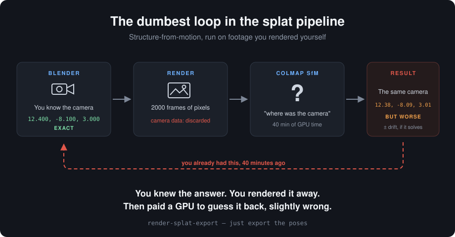

# Splat Export Pipeline

A Blender addon that exports camera poses and a depth-based point cloud from your scene, then converts everything to COLMAP format — ready to drop straight into [Postshot](https://www.jawset.com/) or [LichtFeld Studio](https://github.com/MrNeRF/LichtFeld-Studio) for Gaussian Splat training, skipping their built-in structure-from-motion step entirely.

Ground-truth camera poses from Blender are more accurate than anything SfM would estimate from rendered images — so if you already know exactly where your cameras are, there's no reason to make COLMAP re-derive it.

## Why this exists

Most Gaussian Splat pipelines assume you're starting from real-world photos with unknown camera positions, which is what COLMAP's structure-from-motion step is for. If you're rendering from Blender, you already have exact camera transforms — running SfM on synthetic renders is redundant and can even introduce error versus your ground truth.

This addon handles the two things you actually need instead:

1. **Getting your known poses into a format trainers understand**, including the axis-convention conversion (Blender is Z-up; COLMAP/OpenCV expects Y-down, Z-forward) that trips people up.
2. **Generating an initial point cloud from a depth pass**, since skipping SfM means skipping its sparse point cloud output too — most trainers fall back to random initialization without one, which converges slower and less cleanly.

## Features

* **One panel, one Output Folder field.** Every step reads/writes from the same location — no retyping paths into five different scripts.
* **Marker-bound multi-camera support.** Built for a single timeline where the active camera switches via bound markers (`Marker > Bind Camera to Markers`), with the camera free to move within its own block of frames — not just fixed switch points.
* **Depth-based point cloud init**, read natively via `bpy.data.images.load()` — no external `OpenEXR` pip dependency, which is notoriously painful to install into Blender's bundled Python.
* **One-click COLMAP export**, including the newer COLMAP 4.x rig/frame schema some installs require, alongside the classic three files.
* **Built-in COLMAP validation** — runs `colmap model_analyzer` directly from the panel and dumps the full output to a Blender text block.
* **Render-farm friendly.** Designed so a Deadline (or similar) farm render just works normally — marker-based camera switching resolves automatically per frame during a standard farm render, no custom per-task script needed.

## Requirements

* Blender 4.x or 5.x (tested on 5.x — the compositor setup step supports both the legacy `scene.node_tree` API and the newer node-group-based compositor)
* [COLMAP](https://colmap.github.io/) installed locally, if you want to use the validation step (optional — export still works without it)
* A Gaussian Splat trainer that accepts COLMAP-format input, e.g. [Postshot](https://www.jawset.com/) or [LichtFeld Studio](https://github.com/MrNeRF/LichtFeld-Studio)

## Installation

1. Download `splat_export_pipeline.py`
2. In Blender: **Edit > Preferences > Add-ons > Install...**, select the file, enable the checkbox
3. Open the **Splat Export** tab in the 3D Viewport sidebar (press `N`)

Alternatively, paste the file into a new text block in Blender's Scripting tab and click **Run Script** — the panel appears the same way, it just won't persist after closing the file.

## Scene setup this expects

* A single timeline, not separate camera objects rendered in a loop
* Cameras switched via markers bound to camera objects (`Marker > Bind Camera to Markers`), not `scene.camera` set manually per shot
* All cameras sharing the same focal length and sensor size (one shared set of intrinsics)

If your setup differs — fixed camera objects instead of marker switching, or varying intrinsics per camera — the pose export logic will need adjusting. Feel free to open an issue.

## Usage

1. **Export Camera Poses** — reads Frame Start/End/Step (synced from Output Properties, or set manually in the panel), steps through the range, resolves the active camera per frame via marker binding, and writes `transforms.json`.
2. **Setup EXR Depth Output** (one-time) — wires a Z-depth output into the compositor without touching your existing color render output.
3. **Render your scene as normal** (locally or on a farm) — this addon doesn't render anything itself.
4. **Generate Point Cloud from Depth EXRs** — run after rendering finishes. Unprojects every depth pass to world-space points and writes `points.ply`.
5. **Export COLMAP Format** — converts `transforms.json` + `points.ply` into a COLMAP-format folder (`cameras.txt`, `rigs.txt`, `frames.txt`, `images.txt`, `points3D.txt`, plus a copied `images/` folder).
6. **Validate with COLMAP** (optional) — point the panel at your local `colmap.exe` once, then run `model_analyzer` on the export directly from Blender.
7. Drag the resulting `colmap_export` folder into Postshot or LichtFeld Studio.

## Known limitations

* Assumes shared camera intrinsics across all cameras — per-camera intrinsics aren't currently supported.
* The COLMAP export includes `rigs.txt`/`frames.txt` (COLMAP 4.x's rig/frame schema) alongside the classic three files. This was required for a local COLMAP 4.1 dev build's `model_analyzer` to accept the export; it's untested whether every downstream trainer reads or ignores these two extra files. Tested working with Postshot.
* Point cloud generation processes one full frame at a time and can take a while for large frame counts — a progress log file (`pointcloud_progress.log`) is written to the output folder so you can check it's still running without needing Blender's System Console open.

## License

MIT — do whatever you want with it.

## Acknowledgments

Inspired by [skysplat_blender](https://github.com/kyjohnso/skysplat_blender).
